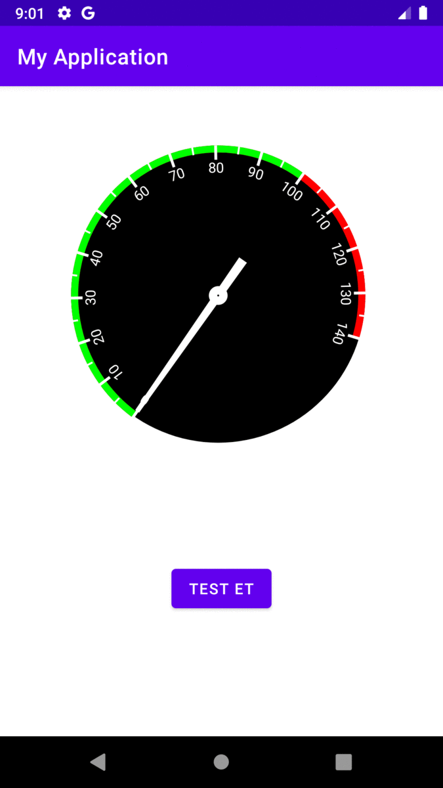

# Android-Java-Internet-Speed-Test
This application measures the internet speed and displays it with an indicator on the screen.  

Libraries used in the application  
-----------------------------------------
-<a href="https://github.com/bertrandmartel/speed-test-lib"><b>JSpeedTest</b> </a> 
-<a href="https://github.com/jignesh13/SpeedoMeter"><b>SpeedoMeter</b> </a> 

  <b>Turkish Language</b>

Bu uygulama internet hızını ölçüp ekranda gösterge ile gösterir.

Uygulamada kullanılan kütüphaneler  
-----------------------------------------
-<a href="https://github.com/bertrandmartel/speed-test-lib"><b>JSpeedTest</b> </a> 
-<a href="https://github.com/jignesh13/SpeedoMeter"><b>SpeedoMeter</b> </a> 
